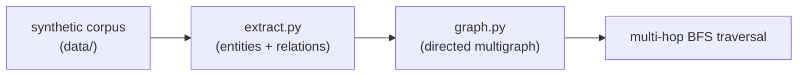
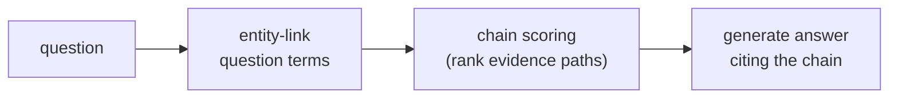
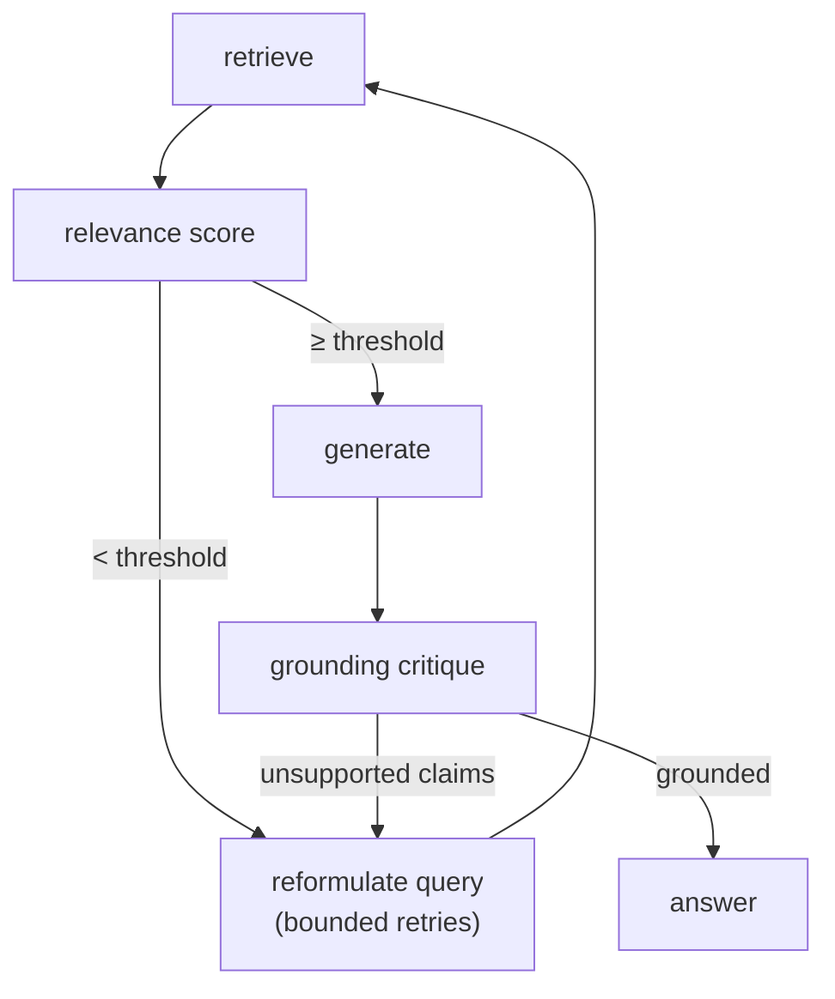
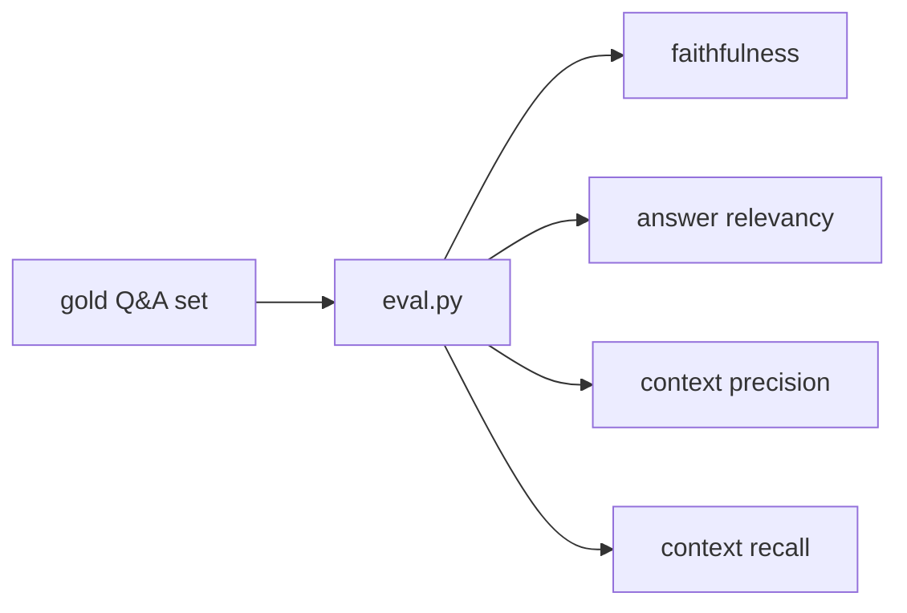

# Agentic RAG: architecture

## Knowledge-graph construction

```mermaid
flowchart LR
    DOCS["synthetic corpus\n(data/)"] --> EXT["extract.py\n(entities + relations)"]
    EXT --> G["graph.py\n(directed multigraph)"]
    G --> BFS["multi-hop BFS traversal"]
```

## GraphRAG answering

```mermaid
flowchart LR
    Q["question"] --> EL["entity-link\nquestion terms"]
    EL --> CS["chain scoring\n(rank evidence paths)"]
    CS --> GEN["generate answer\nciting the chain"]
```

## Self-RAG / corrective-RAG loop

```mermaid
flowchart TD
    R1["retrieve"] --> S["relevance score"]
    S -->|"≥ threshold"| G2["generate"]
    S -->|"< threshold"| RF["reformulate query\n(bounded retries)"]
    RF --> R1
    G2 --> CR["grounding critique"]
    CR -->|"unsupported claims"| RF
    CR -->|"grounded"| A["answer"]
```

## Eval harness

```mermaid
flowchart LR
    GOLD["gold Q&A set"] --> E["eval.py"]
    E --> F["faithfulness"]
    E --> AR["answer relevancy"]
    E --> CP["context precision"]
    E --> CR2["context recall"]
```
